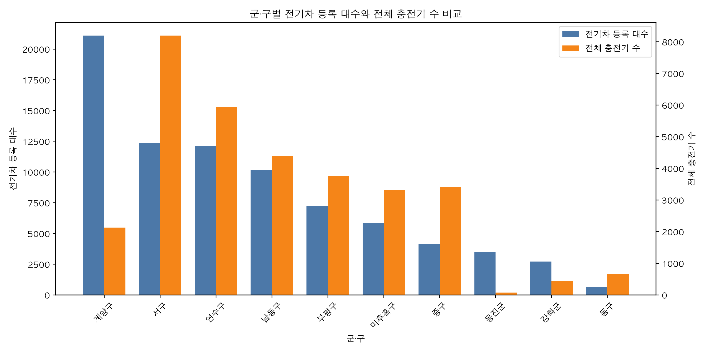
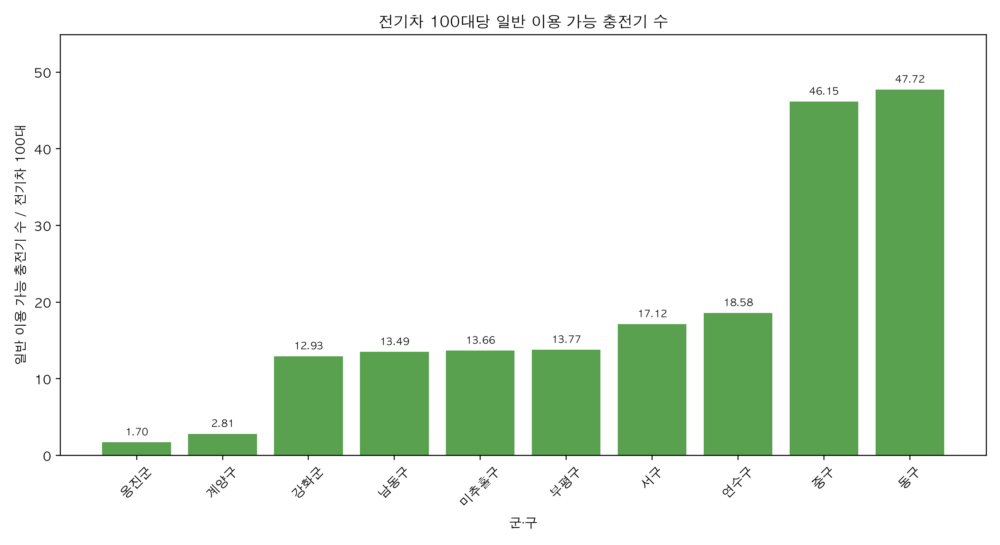
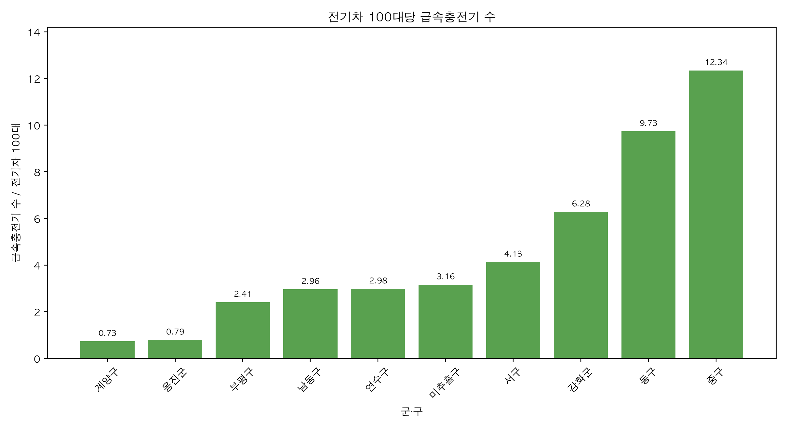
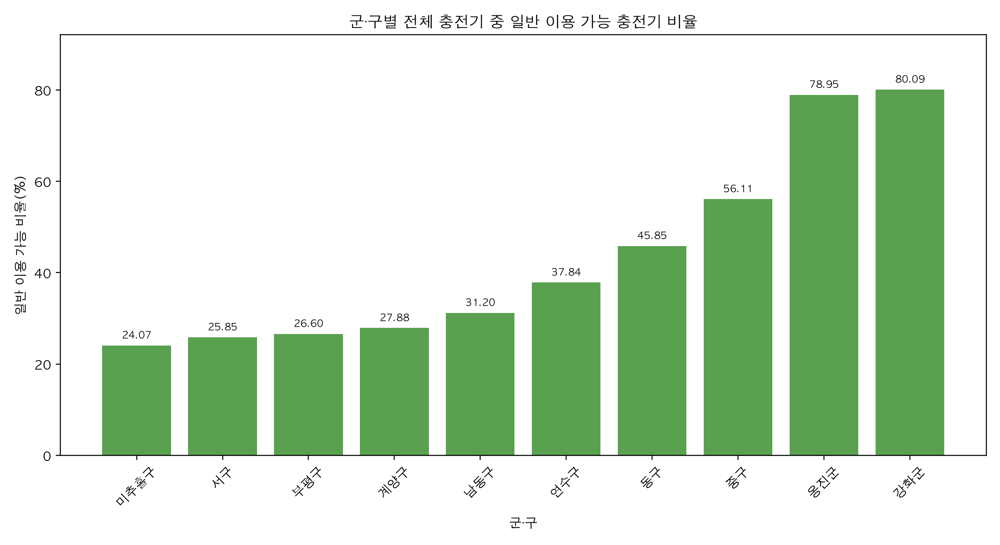

# Incheon EV Charging Infrastructure Analysis

인천광역시 전기차 충전 인프라를 2024년 군·구 행정구역 기준으로 정리하고,
2026년 전기차 등록 대수 대비 충전 공급 수준을 분석한 Python 프로젝트입니다.

## 분석 범위

- 공간 단위: 2024년 인천 10개 군·구
- 전기차 등록 기준일: 2026-02-19
- 충전소 데이터 기준: 2026-07
- 행정구역 경계 기준일: 2024-06-30
- 최종 분석 단위: 군·구 단위 수요·공급 비교

전기차 등록 자료와 충전소 자료의 기준 시점이 다르므로, 본 프로젝트의 100대당 공급 지표는
`2026년 2월 19일 등록 전기차 100대당 2026년 7월 충전기 수`로 해석해야 합니다.

## 핵심 산출물

### 최종 표

- `outputs/tables/final_district_analysis_summary.csv`
- `outputs/tables/final_data_quality_summary.csv`
- `outputs/tables/final_figure_inventory.csv`
- `outputs/tables/final_map_inventory.csv`
- `outputs/tables/dbscan_exploratory_summary.csv`

### 최종 분석 노트

- `reports/final_analysis_notes.md`

## 최종 그래프

군·구별 전기차 등록 대수와 전체 충전기 수 비교:



전기차 100대당 일반 이용 가능 충전기 수:



전기차 100대당 급속충전기 수:



군·구별 전체 충전기 중 일반 이용 가능 충전기 비율:



## 대화형 지도

Folium으로 생성한 HTML 지도는 파일 크기가 커서 Git 추적 대상에서 제외했습니다.
로컬에서 아래 스크립트를 실행하면 `outputs/maps/`에 다시 생성됩니다.

```bash
.venv/bin/python src/create_basic_folium_maps.py
```

생성되는 지도:

- `outputs/maps/station_marker_cluster_map.html`
- `outputs/maps/station_capacity_circle_map.html`
- `outputs/maps/public_charger_heatmap.html`
- `outputs/maps/district_supply_choropleth_map.html`

DBSCAN 탐색 지도는 다음 스크립트 실행 시 생성됩니다.

```bash
.venv/bin/python src/analyze_station_dbscan.py
```

## DBSCAN 분석 위치

DBSCAN은 충전소 단위 좌표를 EPSG:5179로 변환해 탐색적으로 수행했습니다.
다만 인천은 도심, 외곽, 섬 지역의 공간 밀도 차이가 커서 하나의 `eps`와 `min_samples`로
안정적인 군집을 정의하기 어렵습니다. 따라서 최종 취약지역 지표로 사용하지 않고
탐색적 보조 분석으로만 남겼습니다.

관련 파일:

- `outputs/tables/dbscan_parameter_comparison.csv`
- `outputs/tables/dbscan_exploratory_summary.csv`
- `data/processed/charging_station_dbscan.csv`

## 실행 순서

이미 생성된 산출물이 저장소에 포함되어 있지만, 전체 파이프라인을 다시 실행하려면 다음 순서를 따릅니다.

```bash
.venv/bin/python src/preprocess_charging_data.py
.venv/bin/python src/finalize_charging_data.py
.venv/bin/python src/reclassify_charging_to_2024_districts.py
.venv/bin/python src/preprocess_ev_registration.py
.venv/bin/python src/merge_charging_and_ev_registration.py
.venv/bin/python src/build_station_level_spatial_data.py
.venv/bin/python src/create_basic_folium_maps.py
.venv/bin/python src/analyze_station_dbscan.py
.venv/bin/python src/prepare_final_analysis_outputs.py
```

## 주의 사항

- 급속·완속 분류는 충전용량 `output >= 50kW` 기준의 프로젝트 분석용 임시 분류입니다.
- 군·구 단위 분석은 행정구역 내부의 세부 접근성 차이를 직접 설명하지 않습니다.
- 일반 이용 가능 충전기 수는 전체 충전기 수보다 실제 시민 접근성을 설명하는 데 더 적합한 보조 지표입니다.
